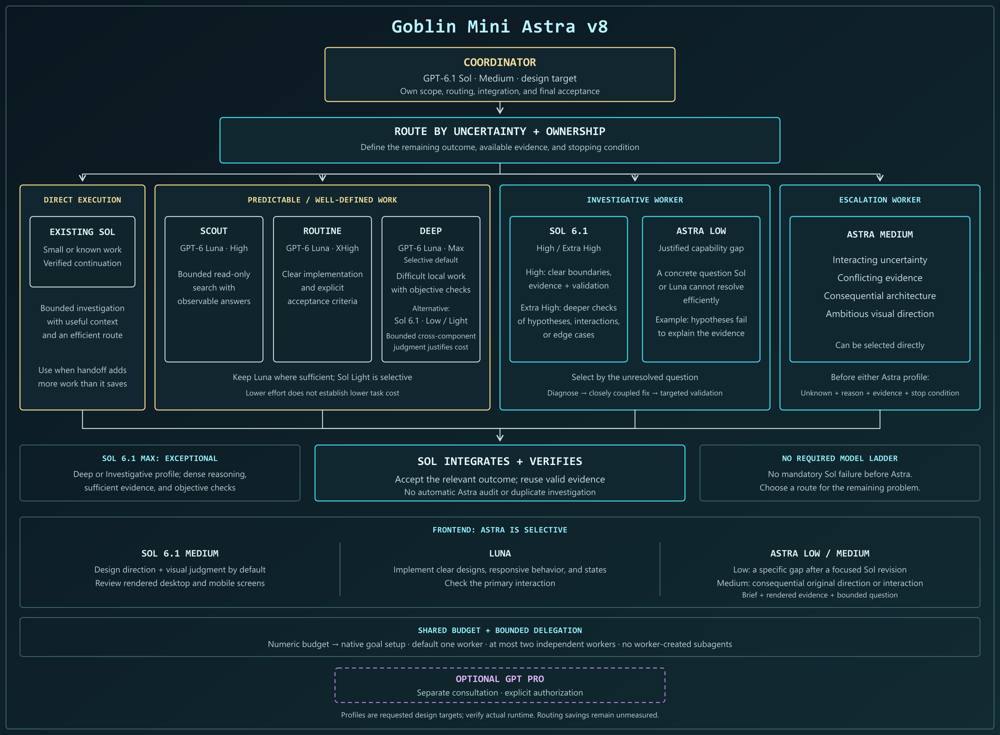

# Goblin Mini Astra

Current skill version: **v8**. GPT-6.1 Sol Medium coordinates GPT-6 Luna workers, with selective Sol 6.1 Low/High/XHigh execution and justified Astra Low/Medium use. Numeric budgets include native goal setup; `No budget` skips it. Increment the version in this README, the skill declaration, and its footer for behavior changes.

A Codex skill focused on conserving Codex quota while meeting task acceptance criteria. Sol 6.1 Medium coordinates and investigates when efficient; Luna handles predictable bounded work; selective Sol or Astra workers resolve harder uncertainty. Routing targets cost or attributable quota per accepted outcome, including retries and review, rather than token count alone.

Derived from [Goblin Mini Pro](https://github.com/abangkis/goblin-mini-pro), with quota-conscious routing and an optional authorized GPT Pro decision gate.

## Roles

| Role | Model / reasoning design target | Purpose |
| --- | --- | --- |
| Coordinator | GPT-6.1 Sol / Medium | Scope, routing, direct investigation when efficient, integration, and final acceptance |
| Scout | GPT-6 Luna / High | Bounded read-only investigation |
| Routine Worker | GPT-6 Luna / XHigh | Implementation and debugging with clear acceptance criteria |
| Deep Worker | GPT-6 Luna / Max by default; GPT-6.1 Sol / Low selectively | Difficult bounded problems; Sol Low for justified cross-component understanding or judgment |
| Investigative Worker | GPT-6.1 Sol / High or XHigh; GPT-6 Astra / Low for a justified capability gap | Resolve bounded uncertainty, a closely coupled fix, and targeted validation |
| Escalation Worker | GPT-6 Astra / Medium | Resolve interacting uncertainty, consequential architecture, or ambitious visual direction |

Small tasks stay with the Coordinator when delegation would add more work. There is no mandatory escalation ladder. Delegation depends on the host's available tools and conditions; a skill cannot change the main task's model or reasoning effort. Select the intended Coordinator runtime in your host. Actual runtime is reported only when authoritative metadata establishes it.

### Choosing a worker

Keep bounded searches on Luna High, clear implementations on Luna XHigh, and difficult local problems with objective checks on selective Luna Max. Sol 6.1 Light (`low`) is an alternative Deep profile when a bounded task needs cross-component understanding or judgment. Lower reasoning effort does not establish a lower task cost than Luna Max; compare accepted outcomes, retries, handoffs, Coordinator work, and attributable usage.

The Coordinator can finish bounded investigations directly when its existing context makes delegation inefficient. For delegated investigations, Sol 6.1 High fits clear boundaries, sufficient evidence, and a validation path; XHigh fits plausible hypotheses, interactions, or edge cases needing deeper analysis. Sol 6.1 Max is an exceptional Deep or Investigative profile for dense, well-defined reasoning with objective checks, not a permanent role or required escalation step.

Before requesting Astra, specify the unresolved question, why the available Sol or Luna route cannot resolve it efficiently, required evidence, and a stopping condition. Astra Low fits a bounded capability gap, such as hypotheses that do not explain the evidence. Use Astra Medium directly for interacting or consequential uncertainty when a lighter route would likely repeat work. A long task or unexplained tool failure is not an Astra trigger, and no failed Sol attempt is required. An investigation stops when its question and bounded fix are verified or new evidence, access, or scope is needed. A large mechanical remainder can go to Luna when that saves more than the handoff costs. Sol accepts the relevant diff and evidence without repeating discovery.

For frontend work, **Sol 6.1 Medium leads design by default** and Luna implements clear designs and states. Inspect rendered desktop/mobile screens and the primary interaction. Use Astra Low only for a specific unresolved visual or interaction gap after a focused Sol revision; give it the brief, screenshots, observed gap, and bounded question rather than restarting the frontend. Use Astra Medium directly for consequential original direction or complex experience-wide tradeoffs. These are routing hypotheses: compare accepted frontend results, retries, handoffs, and attributable usage before claiming savings or retiring Astra from frontend work.

Select **GPT-6.1 Sol Medium** as the main task runtime in Codex to match the Coordinator profile. Updating this skill does not switch an existing task model. Sol 6.1 Light maps to `low`; `none` and `minimal` are unsupported. Request each worker's selected model and effort explicitly through available host controls. All workers share the task budget, with one worker by default, at most two independent workers concurrently, and no worker-created subagents. The budget helper and native goal flow are unchanged. Relative cost effectiveness of these routes has not been benchmarked.

Official references: [GPT-6.1 Sol specifications](https://developers.openai.com/api/docs/models/gpt-6.1-sol), [model and effort selection](https://learn.chatgpt.com/docs/models), and [Codex pricing](https://learn.chatgpt.com/docs/pricing). Model positioning and token rates are not measured savings for this workflow.

## Routing diagram



The diagram shows conditional worker selection, the Astra gate, and shared budget controls. [Download the editable SVG](assets/goblin-mini-astra-v8-routing.svg).

## Quota-conscious workflow

- Inspect only enough to give a delegate a useful boundary.
- Carry relevant context and trusted evidence instead of full conversation history.
- Default to one leaf delegate; the Coordinator may use up to two concurrently for independent tasks when the expected benefit justifies additional quota and coordination overhead. Subagents cannot create subagents.
- Reuse successful investigation and validation while their relevant inputs remain unchanged.
- Escalate based on diagnosed uncertainty, not task length or an unexplained failure.
- Verify the changed boundary without an automatic full Astra audit or redundant tests.

This is a routing baseline, not a measured savings guarantee. API pricing and token counts do not establish Codex subscription quota charges. Quota savings have not been benchmarked.

## Budget defaults and options

On first use, Codex asks for a default: **1 million**, **5 million**, **10 million tokens**, or **your own positive amount**. No number is selected automatically. This one-time setup also applies to simple tasks. Python 3 is required for the bundled standard-library helper, which returns the setup status; Codex asks the question in conversation rather than opening a terminal prompt.

The choice applies to each new task until explicitly changed:

| Example request | This task | Saved default |
| --- | --- | --- |
| No budget instruction | Uses saved default | Unchanged |
| `Use a budget of 2 million tokens for this task` | 2 million tokens | Unchanged |
| `No budget for this task` | No task token ceiling | Unchanged |
| `Change the default budget to 10 million tokens` | Existing task retains its budget unless asked otherwise | 10 million for future tasks |
| `Change the default to no budget` | Existing task retains its budget unless asked otherwise | No ceiling for future tasks |

Follow-up messages and repeated skill invocations retain the current task budget and accumulated usage. A numeric override changes the task's total ceiling, not an additional allowance. Explicitly request use of the saved default again to clear a task override. `No budget` does not disable efficient routing, validation, or actual-usage reporting.

Preferences live in `$CODEX_HOME/skill-settings/goblin-mini-astra/budget.json` (fallback `~/.codex/skill-settings/goblin-mini-astra/budget.json`). They are local to the user/host, survive skill-folder upgrades, and are not included in this repository. Only an explicit default selection/change writes this file. Task overrides are resolved without modifying it.

See [budget setup and helper commands](references/budget-options.md) for first-use behavior, custom values, errors, and precedence. The helper resolves policy; it does not count tokens or enforce a host-level hard stop. Installing or editing the skill does not start setup or choose your default.

### Native budget setup, usage checks, and reporting

A numeric saved default or explicit task budget includes the user's request to start or reuse a native goal with that budget, without another confirmation. This applies to simple tasks too. The Coordinator inspects existing state, preserves unfinished goals/counters, and verifies native readback before reporting `native configured`. If the previous goal is complete, the new task can start its requested goal directly. `No budget` skips native goal creation and token-budget setup; removing an existing cap requires supported host controls, not clearing usage history. Unsupported setup or conflicting unfinished goals are reported as actual limitations, not renewed permission requests.

Native usage is read at consequential decisions and once for the final report, reusing available metadata. Existing goals and accumulated usage are preserved. Worker accounting is verified separately; known goal usage is reported even when total worker coverage is unknown. The helper explicitly returns `native_budget_state: unchecked` and no usage measurement; Codex performs native tool integration as described in [the native budget reference](references/native-budget.md).

For a shorter explanation aimed at users, including what happens when the budget is close to being reached or has been reached, read [How Goblin Mini Astra budgeting works](references/budget-behavior.md).

For nontrivial tasks, the Coordinator keeps a small task-local checkpoint of the initial budget, measured usage, verified progress, and remaining work. It reuses available metadata and checks fresh usage only when that could change a costly delegation, escalation, investigation, or phase decision. There is no dedicated monitoring agent or periodic polling, and checking costs are part of the tradeoff.

Reserve enough room for integration, validation, and handoff. Low account quota discourages optional work with marginal value, while required validation remains mandatory. A budget is not a spending target. Numeric budgets and native setup are one bundled request; setup never expands authorization for the underlying work.

The final report for nontrivial work includes initial budget/source, native state, actual measured tokens with scope, and accounting coverage. Missing usage is `unavailable` with a reason; `partial` requires an existing scoped measurement. If the ceiling changes mid-task, retain the initial value and report the current ceiling too. Account quota is not task usage. Simple tasks omit routine bookkeeping unless requested, but existing native goals or requested native caps are still checked. Native configuration does not prove exact stopping or in-flight worker coverage. Savings remain unmeasured.

## Install

Ask Codex:

```text
Use $skill-installer to install goblin-mini-astra from
https://github.com/abangkis/goblin-mini-astra
```

Alternatively, copy the skill folder to `~/.codex/skills/goblin-mini-astra/` (or the `skills` directory under your configured `CODEX_HOME`). Include `SKILL.md`, `agents/openai.yaml`, all files in `references/`, and `scripts/budget.py`. Preserve the separate user-settings directory when updating the skill.

## Use

```text
$goblin-mini-astra

Complete the following task, conserving Codex quota while meeting these acceptance criteria:
[task, constraints, and desired outcome]
```

The active mode is `MINI-ASTRA`. A later explicit Goblin mode selection replaces it; asking to stop Goblin mode disables this routing. Discussing or editing the skill does not activate execution mode.

Active task responses end with the loaded skill version, for example:

```text
Active Goblin Mode: MINI-ASTRA v8 | Execution footprint: Coordinator.
```

This identifies the skill instructions in use, not the model version. Existing tasks must load updated instructions before reporting a newer skill version.

### Reload in an existing task

Copy this prompt into the task to reload the installed instructions without restarting its work:

```text
$goblin-mini-astra

Read C:\Users\Force\.codex\skills\goblin-mini-astra\SKILL.md from disk and apply the version you actually read, including its relevant references. Confirm the loaded version.

Preserve this task's scope, approvals, completed work, effective budget, native goal, and accumulated usage. Do not restart the task or reset counters. Reloading the skill does not change this task's model.
```

Replace the path if your installed skill is in a different location. To match the Coordinator profile, select GPT-6.1 Sol Medium separately in the host's model controls.

## Optional GPT Pro consultation

Pro is a separate decision or audit consultation, never an implied Astra capability or an execution worker. A consultation requires a real Pro target and explicit authorization for the handoff. Required but unavailable Pro consultation pauses dependent execution; optional consultation does not block routine work.

Pro recommendations are checked against current evidence before implementation. Material conflicts require a revised aligned decision or an explicitly approved documented resolution. The detailed procedure is loaded only when needed from [the Pro gate reference](references/pro-decision-gate.md).

## Validation status

Run helper behavior tests with `python -B -m unittest discover -s tests -v`. Tests use project-local isolated settings, covering first-use setup, saved presets/custom defaults, task overrides, no-budget behavior, invalid data, persistence across processes, and no false claims of native measurement/configuration. They do not alter personal preferences or create native goals. Native goal control and aggregate worker enforcement require live host validation; these tests do not prove them. The v8 update passed eight helper tests and restricted checks for structure, local references, version/UI consistency, and budget preservation. The official `quick_validate.py` could not run because PyYAML was unavailable. Routing has not been independently runtime-tested or quota-benchmarked.

## License

[MIT](LICENSE), copyright (c) 2026 abangkis.
